# Eval Hub

[](https://github.com/eval-hub/eval-hub/actions/workflows/ci.yml)

An API REST server that serves as a routing and orchestration layer for evaluation backends. Supports local development, Podman containers, and Kubernetes/OpenShift deployments.

## Overview

The Evaluation Hub is designed to:

- Parse requests containing lists of evaluations for each backend
- Support risk categories that automatically create appropriate benchmarks
- Route and orchestrate evaluation execution across multiple backends
- Store results in MLFlow experiment tracking server
- Aggregate and return responses to clients
- Handle requests concurrently and asynchronously
- Deploy locally for development, as Podman containers, or on Kubernetes/OpenShift clusters

## Features

- **Multi-Backend Support**: Orchestrates evaluations across different backends (lm-evaluation-harness, GuideLL, NeMo Evaluator, custom backends)
- **Collection Management**: Create, manage, and execute curated collections of benchmarks with weighted scoring and automated provider task aggregation
- **Native Collection Support**: Use `collection_id` directly in evaluation requests for automatic benchmark expansion and execution
- **Provider & Benchmark Discovery**: Comprehensive API for discovering evaluation providers and their available benchmarks
- **Remote Container Integration**: NeMo Evaluator Executor for connecting to remote @Evaluator containers
- **Risk Category Automation**: Automatically generates appropriate benchmarks based on risk categories (low, medium, high, critical)
- **Async Execution**: Handles requests concurrently with progress tracking
- **MLFlow Integration**: Automatic experiment tracking and results storage
- **Flexible Deployment**: Supports local development, Podman containers, and Kubernetes/OpenShift clusters
- **Monitoring**: Prometheus metrics and health checks
- **Scalable**: Horizontal pod autoscaling and configurable concurrency limits

## Architecture


### Core Components

1. **Request Parser**: Validates and expands evaluation specifications
2. **Evaluation Executor**: Orchestrates concurrent evaluation execution using executor pattern
3. **Executor Factory**: Creates and manages backend-specific executors
4. **MLFlow Client**: Manages experiment tracking and result storage
5. **Response Builder**: Aggregates results and builds comprehensive responses

## Quick Start

### Prerequisites

**All Deployments:**
- Python 3.12+
- uv (for dependency management)
- MLFlow tracking server (local or remote)

**Containerized Deployments:**
- Podman (for containerization and local container runs)

**Kubernetes/OpenShift Deployments:**
- Kubernetes/OpenShift cluster access
- kubectl or oc CLI tools

### Local Development

1. **Clone and setup**:
   ```bash
   git clone <repository>
   cd eval-hub
   uv venv
   source .venv/bin/activate  # On Windows: .venv\\Scripts\\activate
   uv pip install -e ".[dev]"
   ```

2. **Environment configuration**:
   ```bash
   cp .env.example .env
   # Edit .env with your configuration
   ```

3. **Run the service**:
   ```bash
   python -m eval_hub.main
   ```

4. **Access the API**:
   - API Documentation: http://localhost:8000/docs
   - Health Check: http://localhost:8000/api/v1/health
   - Metrics: http://localhost:8000/metrics

### Podman Deployment (Optional)

If you prefer containerized deployment:

1. **Build the image**:
   ```bash
   podman build -t eval-hub:latest .
   ```

2. **Run with Podman**:
   ```bash
   podman run -p 8000:8000 -e MLFLOW_TRACKING_URI=http://mlflow:5000 eval-hub:latest
   ```

### Kubernetes/OpenShift Deployment (Optional)

For production cluster deployment:

1. **Deploy to cluster**:
   ```bash
   kubectl apply -k k8s/
   ```

2. **Check deployment**:
   ```bash
   kubectl get pods -n eval-hub
   kubectl logs -n eval-hub deployment/eval-hub
   ```

## API Documentation

For comprehensive API documentation including endpoints, request/response formats, and examples, see **[API.md](./API.md)**.

Key API capabilities:
- **Evaluation Management**: Create, monitor, and manage evaluation jobs
- **Provider Integration**: Support for LM-Evaluation-Harness, RAGAS, Garak, and custom providers
- **Collection Management**: Curated benchmark collections for domain-specific evaluation
- **Real-time Monitoring**: Health checks, metrics, and system status endpoints

## Experiment Configuration

The Evaluation Hub uses a structured `ExperimentConfig` object for MLFlow experiment tracking, replacing the previous scattered `experiment_name` and `tags` fields. This provides better organization and consistency across all evaluation requests.

### ExperimentConfig Schema

```json
{
  "experiment": {
    "name": "string",
    "tags": {
      "additionalProperties": "string"
    }
  }
}
```

### Usage Examples

Example usage:
```json
{
  "model": {...},
  "benchmarks": [...],
  "experiment": {
    "name": "my-evaluation",
    "tags": {"environment": "production", "model_family": "llama"}
  }
}
```

### Benefits

- **Structured Organization**: Experiment configuration is clearly grouped
- **Type Safety**: Better validation and documentation with OpenAPI schema
- **Consistency**: All evaluation endpoints use the same experiment structure
- **MLFlow Integration**: Direct mapping to MLFlow experiment metadata

## Collection Management

The Evaluation Hub includes a comprehensive collection management system for creating, managing, and executing curated collections of benchmarks with weighted scoring and automated provider task aggregation.

### Key Features

- **Curated Benchmark Sets**: Pre-configured benchmark combinations for specific evaluation domains
- **Weighted Scoring**: Configurable weights for different benchmarks based on importance
- **Automatic Execution**: Single API call expands to multiple benchmark evaluations
- **Provider Optimization**: Intelligent grouping by evaluation provider for efficient execution

### Collection Best Practices

1. **Weighted Scoring**: Use benchmark weights to reflect importance in aggregate scoring
2. **Coherent Collections**: Group related benchmarks that assess similar capabilities
3. **Configuration Consistency**: Use consistent `num_fewshot` and `limit` settings within collections
4. **Descriptive Metadata**: Include comprehensive metadata for collection discovery and management
5. **Version Management**: Use version tags (v1, v2) for collection evolution
6. **Provider Optimization**: Group benchmarks by provider for efficient execution

### Collection-Based Evaluations

Collections allow you to run curated sets of benchmarks with a single API call. The system automatically:
- Looks up the collection by ID
- Extracts all benchmarks from the collection
- Groups benchmarks by provider for efficient execution
- Creates appropriate backend configurations with preserved weights and configs
- Executes with proper task aggregation

#### Collection Processing Flow

```mermaid
flowchart TD
    A[🔍 Evaluation Request with collection_id] --> B[📋 Lookup Collection]
    B --> C[📦 Collection: coding_reasoning_v1]

    C --> D[🔄 Extract & Group Benchmarks]

    D --> E1[📊 lm_evaluation_harness Group]
    D --> E2[🔬 ragas Group]
    D --> E3[🛡️ garak Group]

    E1 --> F1["🎯 LMEval Backend Config
    - arc_easy (weight: 1.5)
    - humaneval (weight: 2.0)
    - mbpp (weight: 2.0)
    - bbh (weight: 1.5)"]
    E2 --> F2["🔍 RAGAS Backend Config
    - faithfulness
    - answer_relevancy"]
    E3 --> F3["🛡️ Garak Backend Config
    - toxicity
    - bias_detection"]

    F1 --> G1["⚡ LMEval Task Aggregation
    Single CR: [arc_easy, humaneval, mbpp, bbh]"]
    F2 --> G2["🔍 RAGAS Execution
    Individual benchmarks"]
    F3 --> G3["🛡️ Garak Execution
    Individual benchmarks"]

    G1 --> H[📊 Results Aggregation]
    G2 --> H
    G3 --> H

    H --> I["🎯 Weighted Final Score
    Based on collection weights"]

    style A fill:#e1f5fe
    style C fill:#fff3e0
    style D fill:#f3e5f5
    style E1 fill:#e8f5e8
    style E2 fill:#fff3e0
    style E3 fill:#fce4ec
    style H fill:#e0f2f1
    style I fill:#e1f5fe
```



**Key Processing Details**:
- **Provider Grouping**: Benchmarks automatically grouped by `provider_id` for optimal execution
- **Weight Preservation**: Individual benchmark weights maintained through the process
- **LMEval Optimization**: All lm-evaluation-harness tasks combined into single execution for efficiency
- **Config Inheritance**: Benchmark-specific configs (num_fewshot, limit) preserved per benchmark
- **Parallel Execution**: Different provider groups can execute in parallel
- **Result Aggregation**: Final scoring uses preserved weights for accurate collection-level metrics


## Configuration

### Environment Variables

| Variable | Description | Default |
|----------|-------------|---------|
| `APP_NAME` | Application name | "Evaluation Hub" |
| `LOG_LEVEL` | Logging level | "INFO" |
| `API_HOST` | API bind host | "0.0.0.0" |
| `API_PORT` | API port | 8000 |
| `MLFLOW_TRACKING_URI` | MLFlow server URI | "http://localhost:5000" |
| `MAX_CONCURRENT_EVALUATIONS` | Max concurrent evaluations | 10 |

### Risk Category Configuration

Risk categories automatically select appropriate benchmarks:

- **Low**: Basic benchmarks (hellaswag, arc_easy)
- **Medium**: Standard benchmark suite
- **High**: Comprehensive evaluation
- **Critical**: Full benchmark suite with no limits

### Backend Configuration

Supported backends:
- **lm-evaluation-harness**: Standard language model evaluation
- **Lighteval**: Lightweight evaluation via Kubeflow Pipelines
- **GuideLL**: Performance and latency evaluation
- **NeMo Evaluator**: Remote @Evaluator containers for distributed evaluation
- **Custom**: User-defined evaluation backends

#### NeMo Evaluator Integration

The eval-hub uses the NeMo Evaluator Executor to connect to remote @Evaluator containers, enabling distributed evaluation across multiple specialized containers. This allows you to:

- **Leverage specialized evaluation containers** deployed remotely
- **Distribute evaluation workloads** across multiple NeMo Evaluator instances
- **Use containerized evaluation frameworks** without local installation
- **Scale evaluation capacity** by connecting to multiple remote containers

##### Configuration Parameters

**Required Parameters**:
| Parameter | Description | Example |
|-----------|-------------|---------|
| `endpoint` | NeMo Evaluator container hostname/IP | `"nemo-evaluator.example.com"` |
| `model_endpoint` | Model API endpoint for evaluations | `"https://api.openai.com/v1/chat/completions"` |

**Optional Parameters**:
| Parameter | Type | Default | Description |
|-----------|------|---------|-------------|
| `port` | int | `3825` | NeMo Evaluator adapter port |
| `endpoint_type` | string | `"chat"` | API type: `chat`, `completions`, `vlm`, `embedding` |
| `api_key_env` | string | `null` | Environment variable containing API key |
| `timeout_seconds` | int | `3600` | Request timeout in seconds |
| `max_retries` | int | `3` | Maximum retry attempts |
| `verify_ssl` | bool | `true` | Verify SSL certificates |
| `auth_token` | string | `null` | Bearer token for container authentication |
| `health_check_endpoint` | string | `null` | Custom health check endpoint |
| `run_post_hooks` | bool | `false` | Trigger post-evaluation hooks |

**NeMo Evaluation Parameters**:
| Parameter | Type | Default | Description |
|-----------|------|---------|-------------|
| `framework_name` | string | `"eval-hub-client"` | Framework identifier |
| `command` | string | `"evaluate {{ config.type }}"` | Jinja2 command template |
| `limit_samples` | int | `null` | Limit evaluation samples (for testing) |
| `max_new_tokens` | int | `512` | Maximum tokens to generate |
| `parallelism` | int | `1` | Evaluation parallelism |
| `temperature` | float | `0.0` | Generation temperature |
| `top_p` | float | `0.95` | Top-p sampling parameter |
| `request_timeout` | int | `60` | Model API request timeout |

The NeMo Evaluator can be configured for single remote containers, multiple specialized containers, or local development setups by specifying the appropriate endpoint, model endpoint, and configuration parameters.

The NeMo Evaluator Executor communicates with remote containers using HTTP/JSON POST to `/evaluate` with structured request and response formats containing evaluation commands, configurations, and results.

##### Error Handling & Performance

**Comprehensive Error Handling**:
- **Connection failures**: Automatic retry with exponential backoff
- **Timeout handling**: Configurable timeouts for long-running evaluations
- **Health check failures**: Warnings logged but execution continues
- **Response parsing errors**: Detailed error messages with response content

**Performance Optimization**:
- **Parallel Execution**: Configure `parallelism` for concurrent evaluation
- **Container Scaling**: Deploy specialized containers for different benchmark types
- **Resource Planning**: Consider CPU, memory, network bandwidth, and storage requirements

See `examples/configure_executors.py` for Python-only configuration examples.

#### Lighteval via Kubeflow Pipelines

The eval-hub supports Lighteval framework integration through Kubeflow Pipelines (KFP), providing a lightweight and flexible evaluation solution. Lighteval evaluations run as containerized KFP components with automatic artifact management and ML metadata tracking.

**Key Benefits**:
- **Lightweight**: Minimal dependencies and fast startup
- **KFP-Native**: Automatic artifact management and lineage tracking
- **Flexible**: Supports various model endpoints (OpenAI-compatible APIs)
- **Containerized**: Runs in isolated containers with resource management

**Configuration Example**:

```python
{
  "model": {
    "url": "https://api.openai.com/v1",
    "name": "gpt-4"
  },
  "benchmarks": [
    {
      "benchmark_id": "mmlu",
      "provider_id": "lighteval",
      "config": {
        "num_fewshot": 5,
        "limit": 100,
        "batch_size": 1
      }
    }
  ],
  "experiment": {
    "name": "gpt4-lighteval-evaluation"
  }
}
```

**Supported Benchmarks**:
- **Knowledge**: MMLU, ARC, OpenBookQA
- **Reasoning**: HellaSwag, Winogrande, PIQA, TruthfulQA
- **Math**: GSM8K
- **Code**: HumanEval
- **Reading**: BoolQ

**Backend Specification**:

When using Lighteval via KFP, the backend type should be `kubeflow-pipelines` with `framework: "lighteval"`:

```python
{
  "type": "kubeflow-pipelines",
  "framework": "lighteval",
  "kfp_endpoint": "http://ml-pipeline.kubeflow.svc:8888"
}
```

The adapter automatically handles transformation between eval-hub's format and Lighteval's expected inputs, executes the evaluation in a KFP pipeline, and parses results back to eval-hub format.

## Monitoring

### Health Checks

- Kubernetes liveness and readiness probes configured
- MLFlow and service health monitoring

### Metrics

- Prometheus metrics format
- Includes request counts, duration, evaluation statistics

### Logging

- **Format**: Structured JSON logging (production) or console (development)
- **Levels**: DEBUG, INFO, WARNING, ERROR
- **Context**: Request IDs, evaluation IDs, correlation

## Development

### Project Structure

```
src/eval_hub/
├── api/              # FastAPI application and routes
├── core/             # Configuration, logging, exceptions
├── executors/        # Backend-specific executor implementations
│   ├── base.py       # Abstract Executor base class
│   ├── factory.py    # Executor factory for registration
│   └── nemo_evaluator.py  # NeMo Evaluator remote container executor
├── models/           # Pydantic data models
├── services/         # Business logic services
└── utils/            # Utility functions

examples/             # Python-only configuration examples
├── configure_executors.py  # Programmatic executor configuration
└── test_nemo_evaluator.py # Integration test script

k8s/                  # Kubernetes/OpenShift configurations
tests/                # Test suite
docker/               # Container configurations (Docker/Podman)
```

### Testing

```bash
# Run all tests
pytest

# Run with coverage
pytest --cov=src/eval_hub

# Run specific test categories
pytest -m unit
pytest -m integration
```

### Code Quality

```bash
# Format code
black src/ tests/

# Lint code
ruff src/ tests/

# Type checking
mypy src/
```

## Troubleshooting

### Common Issues

1. **MLFlow Connection Errors**:
   - Verify `MLFLOW_TRACKING_URI` is accessible
   - Check network connectivity and firewall rules

2. **Evaluation Timeouts**:
   - Increase `DEFAULT_TIMEOUT_MINUTES`
   - Check backend availability and performance

3. **Memory Issues**:
   - Reduce `MAX_CONCURRENT_EVALUATIONS`
   - Increase container memory limits

4. **NeMo Evaluator Connection Issues**:
   - **Connection refused**: Check endpoint hostname/IP and port
   - **Authentication errors**: Verify auth_token if required, check SSL certificate validity
   - **Evaluation timeouts**: Increase `timeout_seconds` for long evaluations, check container resource limits
   - **Model API errors**: Verify `model_endpoint` configuration, check API key environment variable

### Logs and Debugging

Use kubectl logs for application logs, the evaluation API for specific evaluation status, and the metrics endpoint for system monitoring.

## Contributing

We welcome contributions! Please see our [Contributing Guide](CONTRIBUTING.md) for detailed information on how to get started, development setup, coding standards, and the contribution process.

Quick links:
- [Development Setup](CONTRIBUTING.md#development-setup)
- [Code Standards](CONTRIBUTING.md#code-standards)
- [Pull Request Process](CONTRIBUTING.md#pull-request-process)
- [Issue Reporting](CONTRIBUTING.md#issue-reporting)

## License

Apache 2.0 License - see LICENSE file for details.
